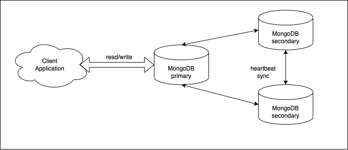

# MongoDB - Replication - High Availability Cluster

_mongodb [4.4] | choose higher version if you like_

## mongodb on HA - these setups help

1. MongoDB Installation [skip if already installed]
2. Hostname Resolution [or we can skip this by IP address]
3. MongoDB with Replication Mode [HA]
4. Joinning the Relication Cluster with Primary Node
5. Automatic Failover



### 1. MongoDB Installation

---

_Here we are refering the linux machine to install mongodb. To install [refer here](https://www.mongodb.com/docs/v4.4/tutorial/install-mongodb-on-red-hat/) or below command on terminal to install_

```
cat >> /etc/yum.repos.d/mongodb.repo <<EOF
[mongodb-org-4.4]
name=MongoDB Repository
baseurl=https://repo.mongodb.org/yum/redhat/7Server/mongodb-org/4.4/x86_64/
gpgcheck=1
enabled=1
gpgkey=https://www.mongodb.org/static/pgp/server-4.4.asc
EOF

yum -y install mongodb-org
```

_if linux machine has firewall service running, we need to enable mongo port by running below command_

```
firewall-cmd --permanent --add-port=27017/tcp
firewall-cmd --reload
```

_now, let's run mongodb as a service on linux, and verify the mongod service status_

```
systemctl enable mongod
systemctl start mongod
systemctl status mongod
```

_**REPEAT** the step in Each & Every machine_

### 2. Hostname Resolution

---

_We are setting up mongodb with 3 linux machine, here we are the ips and their hostname reference as, modify as per your structure_

_Now, let's add hosts as known host for the machine, login to hostname1 machine and run the below command_

```
cat >> /etc/hosts <<EOF
192.168.1.101 hostname1
192.168.1.102 hostname2
192.168.1.103 hostname3
EOF

cat /etc/hosts
```

_Need to add machine hostname in mongod.conf file as, we are refering hostname1 to show_

_[linux](https://www.mongodb.com/docs/v4.4/tutorial/install-mongodb-on-red-hat/): /etc/mongod.conf_

```
net:
  port: 27017                   # default port for mongodb to run
  bindIp: 127.0.0.1,hostname1   # as your IP address here 127.0.0.1,192.168.1.101
```

_**REPEAT** for machine hostname2 - modify the hostname carefully with same machine hostname_

_**REPEAT** hostname3_

### 3. MongoDB with Replication Mode [HA]

---

_Here, we are setting up mongodb with [replication](https://www.mongodb.com/docs/v4.4/replication/) mode, to start the replica set, we need to modify the mongod.conf file_

_[linux](https://www.mongodb.com/docs/v4.4/tutorial/install-mongodb-on-red-hat/): /etc/mongod.conf_

_modify the below parameters in conf file [HA is given value, modify if you like], and restart the mongodb service_

```
replication:
  replSetName: "HA"
```

_now, restart the service by running_

```
sudo systemctl restart mongod
```

_**REPEAT** the step 3 in Each & Every machine_

### 4. Joinning the Relication Cluster with Primary Node

---

_Finally, this step **ONLY** performed in primary db node you choose_

_We are refering hostname1 as primary db, login to hostname1 machine and run below command to connect with mongo cli as_

```
mongo -p 27017
```

_after running command, mongo cli will be loaded, we need to initiate the mongodb replication by running below commands_

```
rs.initiate()

rs.add("hostname2:27017")
rs.add("hostname3:27017")

rs.status()
```

### 5. Automatic Failover

---

_For automatic election(failover) to happen majority of instances need to be available. If we have a replica set of 3, majority is 2. Atleast 2 members needs to be available for election to happen._

_In case of 2 member replica set, majority is 2 (1 is not majority). So the election will not happen when 1 node is down. The only ways is to force reconfigure._

_completed :)_

### ADDITIONAL

---

#### A. How to optimised mongod logs

_Modify [linux](https://www.mongodb.com/docs/v4.4/tutorial/install-mongodb-on-red-hat/): /etc/mongod.conf_

```
systemLog:
  destination: file
  logAppend: true
  #logRotate: 1
  quiet: true
  path: /var/log/mongodb/mongod.log

```

#### B. How to create new db with new user

_start the mongo shell, and run below command modify you like_

```
conn = new Mongo();
db = conn.getDB("test_1");
var appobj = {"name":"My Application", "date": new Date()};
db.app__.save(appobj)
db.createUser(
{   user: "test_user1",
    pwd: "TEST_PASSWORD",
    roles:[{role: "dbOwner", db:"test_1"},],
    mechanisms: ["SCRAM-SHA-1"]
})
```

#### C. How to run mongo db cluster with docker compose

_**prerequisites**_

- Docker should be running
- Docker-compose should be installed

_navigate to the path of **docker-compose.yml**, and the command as_

```
docker-compose up --build --force
```

_Once, the cluster up and running, need to initiate the replication by running below commands in one of docker container_

```
# To connect with container
docker exec -it m1 bash

# To open mongo shell
mongo -p 27017

# To setup replication
rs.initiate()

rs.add("hostname2:27017")
rs.add("hostname3:27017")

rs.status()
```

#### D. How to connect to mongodb cluster

_here is the connection string to connect with mongodb_

- _put your username_
- _put your user password_
- _put your ip or hostanme_
- _put your database name_

```
mongodb://<user>:<password>@<ip_or_hostname_1>:27017,<ip_or_hostname_2>:27017,<ip_or_hostname_3>:27017/<database_name>?retryWrites=false&authSource=<database_name>&authMechanism=SCRAM-SHA-1
```
